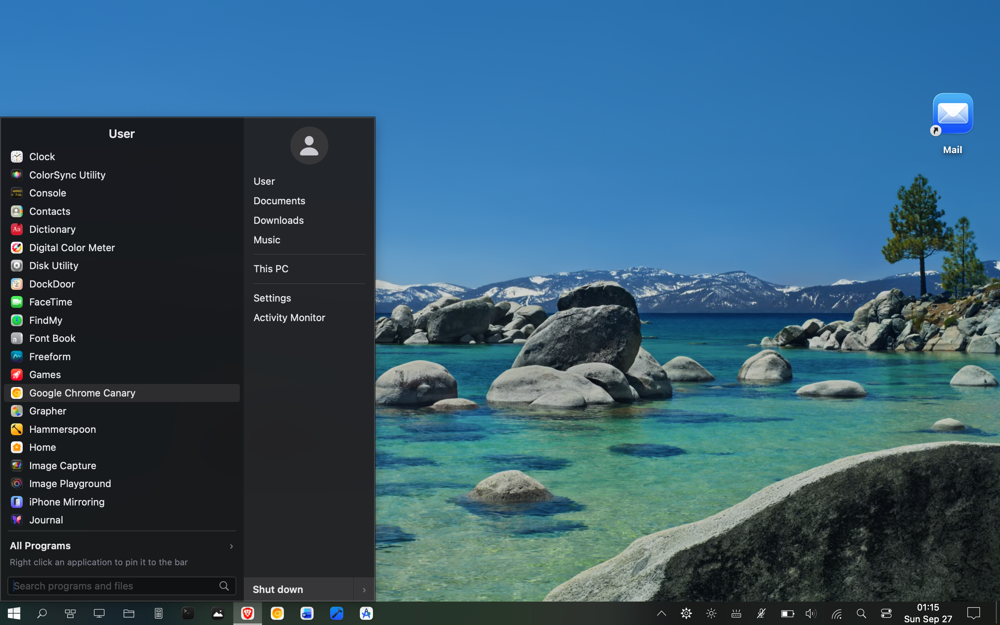
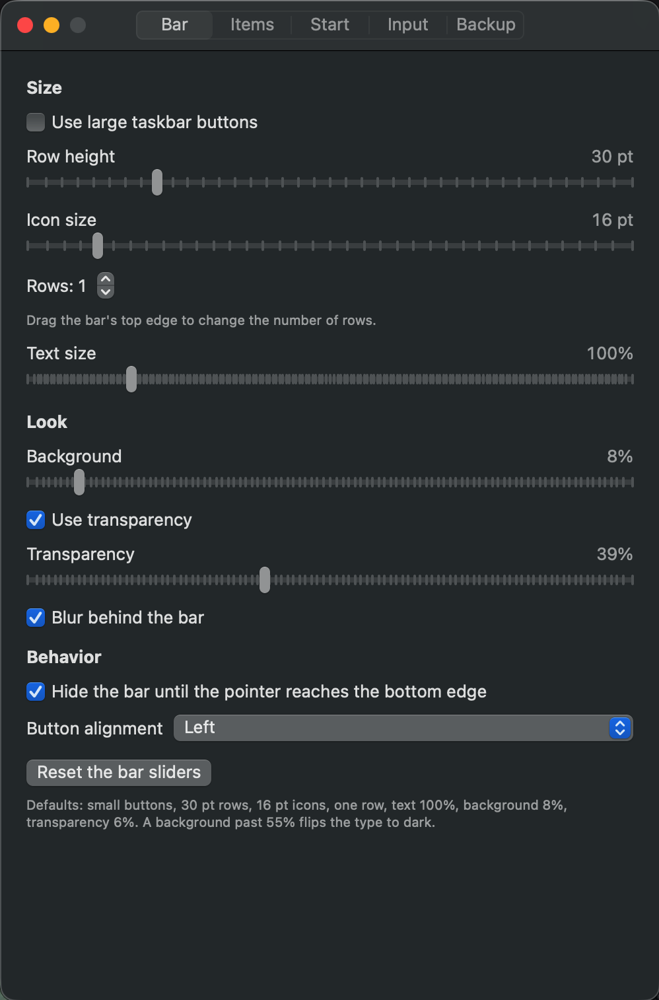
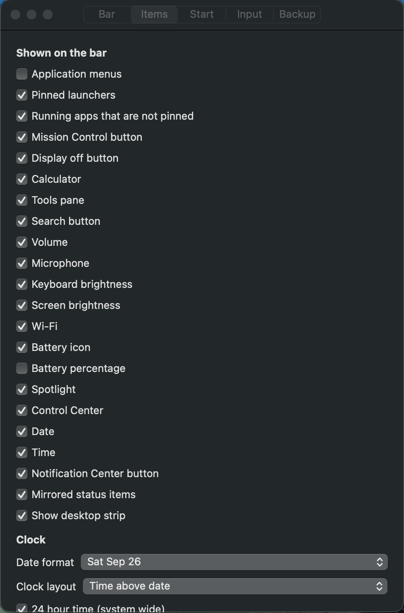
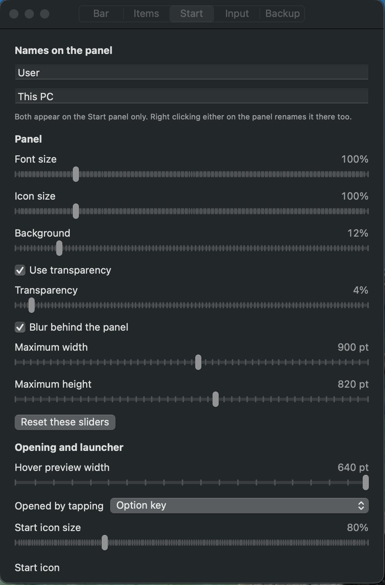
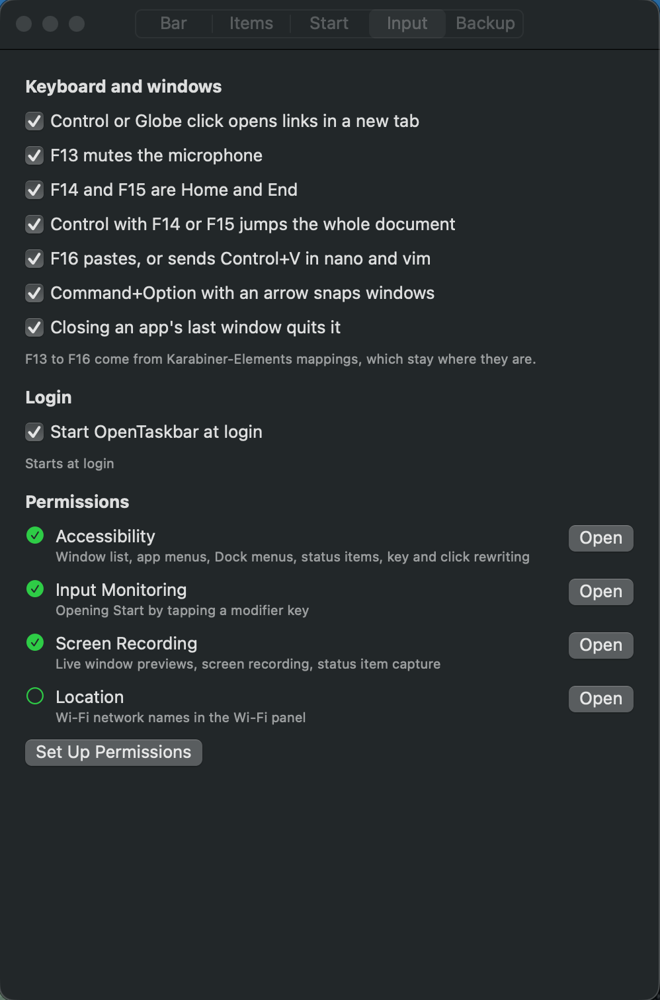

# OpenTaskbar


A native Windows 10-style taskbar for macOS. OpenTaskbar is a fully customizable bottom-docked taskbar with a Start button and full OpenShell style start menu, running-app buttons with adjustable hover peek, a system tray, screen off, calculator, clock, and more. Every size, spacing, and animation timing is pulled from the actual Windows 10 shell. Everything runs locally. It's smooth and fast and works just like Windows, but adapted to Mac functions (such as Finder instead of Windows Explorer). It feels completely seamless from Windows, so your muscle memory works. It's not a port; it was been built from scratch native to MacOS in Swift. I'm planning on making a Windows Explorer replacement as well in the near future, so star this project if you like it! 100% free, no ads, no premium, just free.



## Summary

OpenTaskbar puts a pixel-accurate Windows 10 taskbar on your Mac, with:

- 🪟 **Windows 10 taskbar**: Start button, app buttons, tray, icons, calendar, clock, and more rendered in Swift/AppKit
- 📐 **Pixel-accurate**: every dimension, spacing, and animation timing is measured from Windows 10 and documented
- 🖥️ **Native Swift package**: a single `OpenTaskbar.app` with no dependencies beyond the system frameworks, and optionally Karabiner-Elements for some custom hotkeys
- 🧪 **Snapshot-tested**: UI renders are verified against reference snapshots at 1× and 2×
- 🔒 **Local only**: no network, no accounts, no telemetry. Settings are a plist and a folder in your user profile

## Settings

Many settings let you fully customize OpenTaskbar

Taskbar settings: 
- Bar height
- Icon size
- Number of rows
- Text size
- Background opacity
- Blur
- Autohide
- Button alignment



Items settings:
- App menus
- Pinned launchers
- Pinned apps
- Mission control
- Display off
- Calculator
- tools- Search
- Volumne
- Microphone volume
- Keyboard brightness
- Screen brightness
- Wifi settings
- Battery settings
- Battery percentage
- Spotlight search
- Control center
- Date & Time
- Notification center
- Mirrored status items
- Show desktop strip
- Clock settings
- Custom Calendar
- Tray icons
- Status items



Start Menu settings:
- Username
- This PC name
- Font size
- Icon size
- Background opacity
- Transparency
- Blur
- Width and height
- Preview size (taskbar)
- Start launch key
- Start icon size
- Start icons



Input settings:
- Keyboard shortcuts (Karabiner-Elements remapping to top bar similar to Lenovo)
- Start at login
- Permissions quick launch
- Backup settings to file
- Import settings from file



## Download

Grab the latest release from the [Releases](https://github.com/lso2/OpenTaskbar/releases) page.

1. Download `OpenTaskbar.app.zip`
2. Unzip and drag `OpenTaskbar.app` into your **Applications** folder
3. Open it from Launchpad or Spotlight
4. Grant the requested permissions (Accessibility, Screen Recording) in **System Settings → Privacy & Security**

## Requirements

- **macOS 13+** (Ventura or later)

## Settings and data

All state lives in plain files under your user profile:

| What | Where |
|---|---|
| Bar settings (layout, height, theme, …) | `~/Library/Preferences/com.plexpixel.OpenTaskbar.plist`, key `barSettings` |
| Launcher image | `~/Library/Application Support/OpenTaskbar/` |
| Captured status-item glyphs | `~/Library/Application Support/OpenTaskbar/` |

### Privacy

- **No cloud sync**: everything stays on your computer
- **No accounts**: no login or registration
- **No telemetry**: the app makes no external network requests
- **Readable formats**: a plist and ordinary image files you can inspect or back up

## Logs

Stream debug logs from the running app:

```sh
/usr/bin/log stream --predicate 'subsystem == "com.plexpixel.opentaskbar"' --level debug
```

## Building from source

For contributors or those who prefer to build locally:

```sh
git clone https://github.com/lso2/OpenTaskbar.git
cd OpenTaskbar/app
```

Create a development signing identity (once):

```sh
../tools/make-dev-identity.sh
```

Build and run:

```sh
./make-app.sh
open build/OpenTaskbar.app
```

`make-app.sh` signs with a Developer ID identity when the keychain has one, then with the local "OpenTaskbar Development" identity, then ad hoc. Only a stable identity keeps the privacy grants (Accessibility, Screen Recording) across rebuilds.

### Tests

```sh
swift test
```

With snapshot rendering (keeps the 2× renders on disk for visual inspection):

```sh
OPENTASKBAR_SNAPSHOTS=$PWD/.build/snapshots swift test
```

## Contributing

1. Fork the repository
2. Create a feature branch (`git checkout -b feature/amazing-feature`)
3. Make your changes (keep to the existing Swift 5.9 target)
4. Build and test on macOS 13+
5. Commit your changes (`git commit -m 'Add amazing feature'`)
6. Push to the branch (`git push origin feature/amazing-feature`)
7. Open a Pull Request

## Author

PlexPixel ([plexpixel.com](https://plexpixel.com))

## License

MIT, see the [LICENSE](LICENSE) file for details.

---

**⭐ If OpenTaskbar made your Mac feel more like home, please star the repository!**

## ☕ Buy me a coffee

If OpenTaskbar saves you time every day, consider supporting its development.

[](https://plexpixel.com/donate)

**Why support?**

- ☕ Fuel continued development
- 🚀 New features and modes
- 🐛 Faster fixes and updates
- 📚 Better documentation

---

*Made with ❤️ for people who miss the Windows 10 taskbar on MacOS.*   
